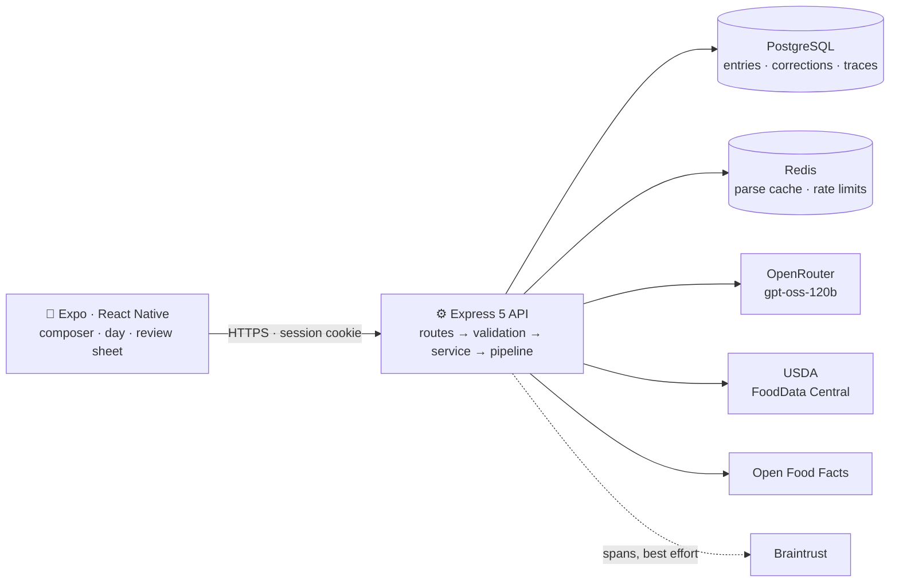
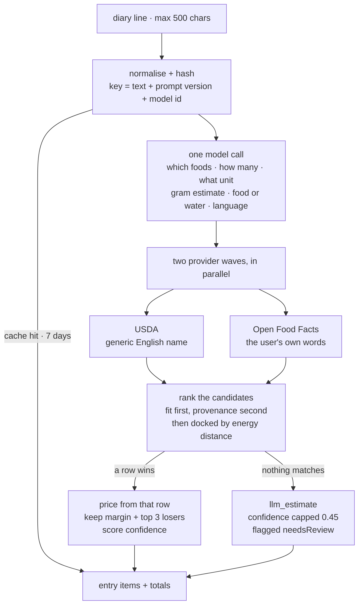

<div align="center">


# Viora

**A meal diary you write like a note.**
One line of free text, Turkish or English, becomes canonical foods, portions and nutrition.

</div>

## The stack

**Mobile** &nbsp;       

**API** &nbsp;       

**Model, data, tooling** &nbsp;      

---

## Running it yourself

**Requirements:** Node 20+, a PostgreSQL database, and a free
[USDA FoodData Central key](https://fdc.nal.usda.gov/api-key-signup). An
[OpenRouter](https://openrouter.ai) key is needed to parse new lines, but not to run the accuracy
suite. Redis and the tracing platform are both optional.

```bash
npm install

cp apps/api/.env.example apps/api/.env        # DATABASE_URL, LLM_*, USDA_API_KEY
npm run db:migrate --workspace=@viora/api

cp apps/mobile/.env.example apps/mobile/.env  # point EXPO_PUBLIC_API_URL at the API

npm run dev          # turbo runs both: the API on :3000 and the Expo dev server
```

Turbo's TUI gives each task its own pane, so Expo's `i` / `a` / QR code still work. To run one
side alone: `npm run api` or `npm run mobile`.

**Checking the accuracy claim needs none of that.** The eval harness replays recorded provider
answers from disk, so it runs on a clean checkout with no keys, no database, no Redis and no
network:

```bash
npm run eval --workspace=@viora/api
```

Ten metrics, the failure histogram, the reliability curve and the per-category breakdown in about
0.3 seconds, byte-identical between runs.

---

## Scope of the build

```
apps/api      Express 5 + TypeScript. The parse pipeline, the correction loop,
              the food providers, the suggestion engine, and the eval harness.
apps/mobile   Expo + React Native. The composer, the day, the review sheet.
presentation  A self-contained case study deck: accuracy, reliability,
              security, and the trade-offs.
```

Beyond meal parsing, the app is a working food diary:

- **A composer, not a form.** Every line in the editor is its own entry. It debounces for a
  second, parses, and prices itself while you keep typing the next one.
- **Days.** Swipe between days, jump around a month calendar, pull to refresh.
- **Water is its own entry kind.** `1 litre su` never becomes a food, and gets its own weekly
  sheet with a goal ring.
- **Saved meals.** Bookmarking a row reuses the parse it already had. Editing the text re-parses.
- **Suggestions** ranked from 90 days of your own history by time of day, weekday, recency and
  habit. Pure and clock-free, because the server is UTC and the person eating is not.
- **Account and settings.** Email and Google sign-in, real account deletion behind a typed
  confirmation, light and dark from one token file, skeletons, an offline banner, two error
  boundaries.

---

## The approach



Two workspaces, five external dependencies. Every external edge has a timeout, a cache, a failure
code, and a defined behaviour when it is down. Three rules keep the boundaries legible:

1. **A route file holds no logic.** It picks a screen and passes props. All twelve route files in
   `apps/mobile/app/` are under fifteen lines.
2. **A feature is imported only through its `index.ts`.** Nothing reaches into another feature's
   internals. When a second feature needs something it moves into `shared/`, and `shared/` may
   never import a feature.
3. **A module is `.routes` then `.validation` then `.service` then the rest.** The route knows
   HTTP, the service knows the database, and the pipeline knows neither.

That last rule is what makes the accuracy work possible. `parseRow(text, deps)` takes its LLM call
and both food providers as injectable dependencies — the single seam that lets the eval harness
replay 126 cases from disk, and lets 80 assertions drive the whole pipeline with stubs, with no
database, no keys and no network.

---

## The core decision

> **The rule the whole architecture is built on: the language model never supplies a number.**
> It reads structure — which foods and how much. Every calorie comes from a food database. When
> no database holds the food, the model's own estimate is used, that item is flagged, and its
> confidence is capped at 0.45. That happens to 1.6% of items.

One model call, two database lookups side by side, then arithmetic.



1. **The line** is capped at 500 characters, unicode-normalised and hashed into a cache key that
   includes the prompt version and the model id, so neither changing can ever serve a stale parse.
2. **One model call.** The line arrives inside `<diary_line>` tags, the first of three injection
   layers. Each item carries **two
   names**, because the two databases are indexed differently: a generic English name for USDA,
   and the user's own words for Open Food Facts, which files a Turkish product under its Turkish
   name. Per-100 g figures come back too, but they are only a fallback and a plausibility signal
   — never the numbers a user sees.
3. **Two provider waves, in parallel.** Nesting them would queue the wide USDA lane behind the
   narrow rate-capped one, so a row would cost the sum instead of the larger of the two.
4. **Picking a row.** Fit first, provenance second; then every row is docked by how far its energy
   sits from the model's own estimate. The winner, its margin over the runner-up, and the top
   three losers are all kept on the item — which is what makes a correction free.
5. **Pricing.** Mass units convert exactly. Volume units ask the model for grams, because a cup of
   cornflakes and a cup of honey share a volume and differ elevenfold in mass. The row's overall
   score is a calorie-weighted mean, so a shaky 20-kcal garnish cannot sink a well-grounded meal.

### The result

| | |
|---|---|
| Gold-set pass rate | **88.1%**, up from 55.6% |
| Test cases | 126 hand-written, Turkish and English, across 15 categories |
| Full accuracy run | **0.3 seconds**, offline, no API keys, deterministic |
| Grounding rate | 98.4% of items priced from a real database row |

---

## Read further

| | |
|---|---|
| 📊 [**The case study deck**](presentation/index.html) | How the accuracy is measured, what the measurement found, and what closed it. Open it in a browser: no server, no network |
| [`apps/api/README.md`](apps/api/README.md) | The ranking algorithm line by line, the correction path, the schema, every route |
| [`apps/mobile/README.md`](apps/mobile/README.md) | The composer model, the review surface, offline and error handling |
